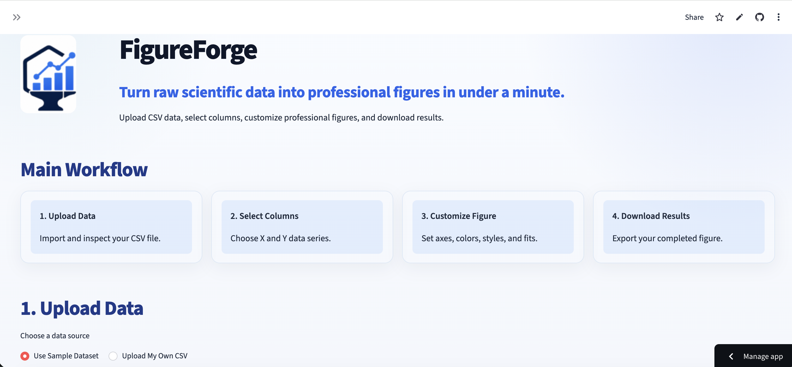
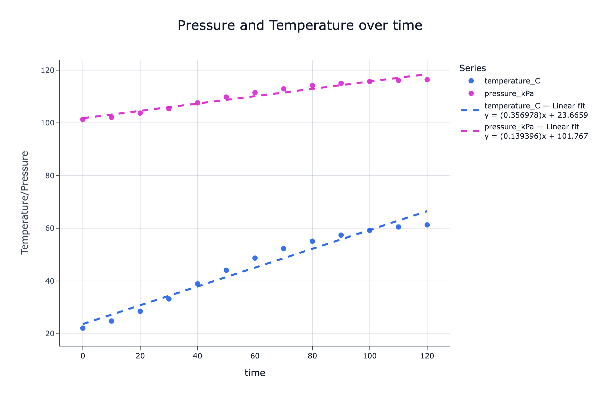

# FigureForge


**FigureForge** is a web application that helps students, researchers, and engineers transform raw CSV data into clean, scientific figures in minutes.

Built with Streamlit, FigureForge provides a simple interface for uploading data, customizing professional plots, fitting curves, and exporting publication quality figures without writing code.

---

## Features

- Upload and preview CSV datasets
- Built-in sample dataset for quick testing
- Multiple Y-axis support
- Line, scatter, and bar charts
- Dual-axis plotting
- Professional publication-style formatting
- Custom colors and line styles
- Marker customization
- Linear and logarithmic axes
- Curve fitting
  - Linear
  - Polynomial
  - Exponential
  - Logarithmic
  - Gaussian
  - Fourier
- Display fitted equations and statistics
- Export figures as:
  - PNG
  - JPEG
  - SVG
  - PDF
  - WebP
  - Interactive HTML

---

## Technology

- Python
- Streamlit
- Plotly
- Pandas
- NumPy
- SciPy

---

## Running Locally

Clone the repository:

```bash
git clone https://github.com/sarah-alizadeh/FigureForge.git
cd FigureForge
```

Install the required packages:

```bash
pip install -r requirements.txt
```

Launch the application:

```bash
streamlit run app.py
```

---

## Example Workflow

1. Upload a CSV file (or use the included sample dataset)
2. Select X and Y columns
3. Customize the figure
4. Export a publication-ready figure

---

## Privacy

Uploaded CSV files are processed only during the active Streamlit session.

Please do **not** upload confidential, proprietary, or personally identifiable information unless you are authorized to do so.

---

## Screenshots

### FigureForge Interface



### Example Output



---
## Technologies

| Technology | Purpose |
|------------|---------|
| Python | Core application |
| Streamlit | Web interface |
| Plotly | Interactive plotting |
| Pandas | CSV processing |
| NumPy | Numerical calculations |
| SciPy | Curve fitting |

## Live Application

https://figureforge.streamlit.app/

---

## Creator

**Sarah Alizadeh**

M.S. Mechanical Engineering Student

Boston University College of Engineering

---

## License

This project is licensed under the MIT License.